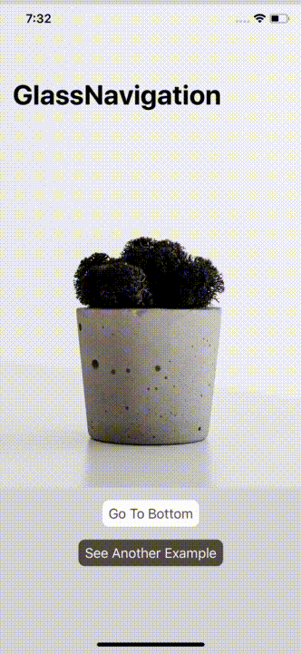
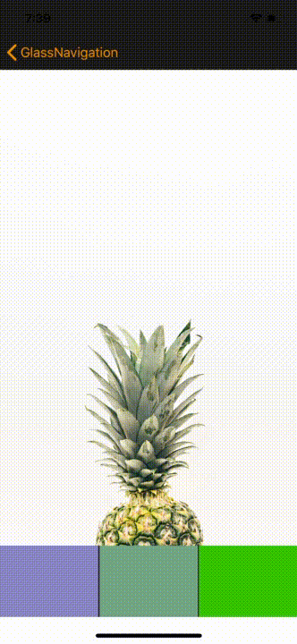

<p align="center">
  
</p>

#  Glass Navigation Bar

[](https://developer.apple.com/swift/)


## Feature

## Demo

<<<<<<< HEAD
<table class="tg">
  <tr>
    <th>Demo1</th>
    <th>Demo2</th>
  </tr>
  <tr>
    <td>
      
    </td>
    <td>
      
    </td>
  </tr>
</table>
=======
| Demo1 | Demo2 |
|-------------------------|--------------------------------------------|
|||

>>>>>>> b9073752f64374771ae4aab19e51cac08e647438

## Installation

### CocoaPods

You can install the latest release version of CocoaPods with the following command

```bash
$ gem install cocoapods
```

Simply add the following line to your Podfile:

```ruby
pod "GlassNavigationBar"
```

Then, run the following command:

```bash
$ pod install
```

## Requirements

`GlassNavigationBar` is written in Swift 4.1, and compatible with iOS 9.0+.

## How to use

## License
