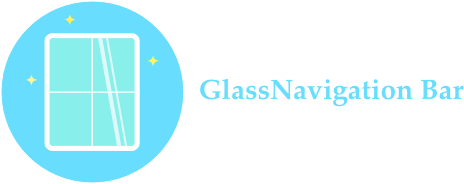
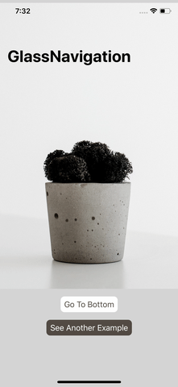
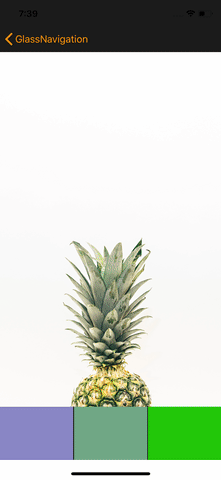

<p align="center">
  
</p>

#  Glass Navigation Bar

[](https://travis-ci.com/hcn1519/GlassNavigationBar)
[](https://developer.apple.com/swift/)


## Feature

## Demo

<table class="tg">
  <tr>
    <th>Demo1</th>
    <th>Demo2</th>
  </tr>
  <tr>
    <td></td>
    <td></td>
  </tr>
</table>

## Installation

### CocoaPods

You can install the latest release version of CocoaPods with the following command

```bash
$ gem install cocoapods
```

Simply add the following line to your Podfile:

```ruby
pod "GlassNavigationBar"
```

Then, run the following command:

```bash
$ pod install
```

## Requirements

`GlassNavigationBar` is written in Swift 4.1, and compatible with iOS 9.0+.

## How To Use

### Quick Start

#### 1. Make your `navigationController` use `GlassNavigationController` instead of `UINavigationController`.

* If you use `storyboard`, Set the class of `navigationController` as `GlassNavigationController`.
* If you Create your navigationController programatically, use `GlassNavigationController` instad of `UINavigationController`.

#### 2. Use `setNavbarTheme(isTransparent: scrollView:)` for your navigationBar basic theme.

```swift
override func viewWillAppear(_ animated: Bool) {
    super.viewWillAppear(animated)
    if let navbarController = self.navigationController as? GlassNavigationController {
        navbarController.setNavbarTheme(isTransparent: true, scrollView: scrollView, color: .green,
                                        tintColor: .yellow, hideBottomHairline: true, contentHeight: 600)
    }
}
```

#### 3. Make your scrollview to put on your navigationBar.

```swift

override func viewDidLoad() {
    super.viewDidLoad()

    scrollView.delegate = self
    if let navbarController = self.navigationController as? GlassNavigationController {
        navbarController.extendedLayoutIncludesOpaqueBars(self)
        navbarController.scrollViewAboveNavigation(scrollView: scrollView)
    }
}

```

#### 4. Set `UIScrollViewDelegate` to change your navigationBar's background color based on scroll.

```swift
extension ScrollViewController: UIScrollViewDelegate {
    func scrollViewDidScroll(_ scrollView: UIScrollView) {
        if let navbarController = self.navigationController as? GlassNavigationController {
            navbarController.scrollViewDidScroll(scrollView)
        }
    }
}
```

That's it. Build and run your app!


## License
