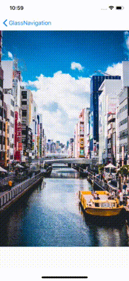
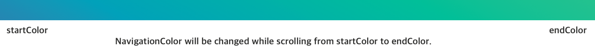

<p align="center">
  
</p>

#  Glass Navigation Bar

[](https://travis-ci.com/hcn1519/GlassNavigationBar)
[](https://developer.apple.com/swift/)
[](https://github.com/hcn1519/GlassNavigationBar)
[](https://github.com/hcn1519/GlassNavigationBar)
[](https://github.com/hcn1519/GlassNavigationBar)

## Feature
* Make yoru NavigationBar Transparent easily
* Adjust your NavigationBar's Transparency, while scrolling
* Support Gradient Style color conversion of your navigationBar

## Demo

<table class="tg">
  <tr>
    <th>Demo1</th>
    <th>Demo2</th>
    <th>Gradient Color Conversion</th>
  </tr>
  <tr>
    <td></td>
    <td></td>
    <td></td>
  </tr>
</table>

## Installation

### CocoaPods

You can install the latest release version of CocoaPods with the following command

```bash
$ gem install cocoapods
```

Simply add the following line to your Podfile:

```ruby
pod "GlassNavigationBar"
```

Then, run the following command:

```bash
$ pod install
```

## Requirements

`GlassNavigationBar` is written in Swift 4.1, and compatible with iOS 9.0+.

## How To Use

### Quick Start

1. Make your `navigationController` use `GlassNavigationController` instead of `UINavigationController`.

* If you use `storyboard`, Set the class of `navigationController` as `GlassNavigationController`.
* If you create your navigationController programatically, use `GlassNavigationController` instance instead of `UINavigationController` instance.

2. You need to pin `ScrollView` Top Constraint to it's `Superview`(make sure it is not `safeArea`)

3. Use `setNavigationTheme(isTransparent: scrollView:)` for your navigationBar basic theme.

```swift
override func viewWillAppear(_ animated: Bool) {
    super.viewWillAppear(animated)
    if let navbarController = self.navigationController as? GlassNavigationController {
        let options = NavigationOptions(backgroundColor: .green, tintColor: .blue, hideBottomHairline: true, contentHeight: 600)
        navbarController.setNavigationTheme(isTransparent: true, scrollView: scrollView, options: options)
    }
}
```

4. Make your scrollview to put on your navigationBar.

```swift

override func viewDidLoad() {
    super.viewDidLoad()

    scrollView.delegate = self
    if let navbarController = self.navigationController as? GlassNavigationController {
        navbarController.extendedLayoutIncludesOpaqueBars(self, scrollView: scrollView)
        navbarController.scrollViewAboveNavigation(scrollView: scrollView)
    }
}
```

5. Set `UIScrollViewDelegate` to change your navigationBar's background color based on scroll.

```swift
extension ScrollViewController: UIScrollViewDelegate {
    func scrollViewDidScroll(_ scrollView: UIScrollView) {
        if let navbarController = self.navigationController as? GlassNavigationController {
            navbarController.scrollViewDidScroll(scrollView)
        }
    }
}
```

That's it. Build and run your app! 🎉🎉 If you don't know how to do this, open up our demo project and see it.

---

### Make NavigationBar Transparent

Make your NavigationBar transparent is really simple.

```swift
override func viewWillAppear(_ animated: Bool) {
    super.viewWillAppear(animated)

    if let navbarController = self.navigationController as? GlassNavigationController {
        navbarController.isTransparent = true
    }
}
```

Or if you also want to make your `navigationItem` or `title`(`titleView`), just set `adjustNavigationItemTransparency`, or `adjustTitleTextTransparency` to `true`.

```swift
override func viewWillAppear(_ animated: Bool) {
    super.viewWillAppear(animated)

    if let navbarController = self.navigationController as? GlassNavigationController {
        navbarController.isTransparent = true
        navbarController.adjustNavigationItemTransparency = true
        navbarController.adjustTitleTextTransparency = true
    }
}
```


### Set NavigationBar theme

You can set navigationBar's theme by using  `setNavigationTheme(isTransparent: scrollView:)`.

```swift
override func viewWillAppear(_ animated: Bool) {
    super.viewWillAppear(animated)

    if let navbarController = self.navigationController as? GlassNavigationController {
        navbarController.setNavigationTheme(isTransparent: true, scrollView: self.scrollView)

        // With some options.
        let options = NavigationOptions(backgroundColor: .green, tintColor: .blue, hideBottomHairline: true, contentHeight: 600)
        navbarController.setNavigationTheme(isTransparent: true, scrollView: scrollView, options: options)
    }
}
```

`setNavigationTheme(isTransparent: scrollView:)` offers you to set some otehr options we have. See Information about these [properties](https://github.com/hcn1519/GlassNavigationBar#property-of-glassnavigationcontroller).

### Put your scrollView above navigationBar

Apple's screen guide has been revised since the iPhone X was released. Apple recommends us to use `safeArea` for background autolayout. However, we often have to put our scroll view on the status bar. To do this, you first need to pin your `scrollView` top constraint to `superview` top constarint.(not `safeArea`). Then just use `adjustNavigationAlpha(scrollView:)`.

```swift
override func viewDidLoad() {
    super.viewDidLoad()
    if let navbarController = self.navigationController as? GlassNavigationController {
        navbarController.scrollViewAboveNavigation(scrollView: scrollView)
    }
}
```


Now Your content will start from top edge of iphone screen.


### Change Alpha of navigationBar's color based on ScrollView's content offset

`GlassNavigationController` use `UIScrollViewDelegate` to change your navigationBar's background color.

1. Set `UIScrollViewDelegate` for your ViewController

```swift
override func viewDidLoad() {
    super.viewDidLoad()
    scrollView.delegate = self
}
```
2. Allow your ViewController  `extendedLayoutIncludesOpaqueBars` to `true`

```swift
override func viewDidLoad() {
    super.viewDidLoad()
    if let navbarController = self.navigationController as? GlassNavigationController {
        navbarController.extendedLayoutIncludesOpaqueBars(self, scrollView: scrollView)
    }
}
```

If you don't do that, your scrollView works weird, when it's alpha becomes `1`.

3. Inside `scrollViewDidScroll` do like this.

```swift
extension ViewController: UIScrollViewDelegate {
    func scrollViewDidScroll(_ scrollView: UIScrollView) {
        if let navbarController = self.navigationController as? GlassNavigationController {
            navbarController.scrollViewDidScroll(scrollView)
        }
    }
}
```

⚠️ We highly recommend you to use this feature with `setNavigationTheme()` function, or set navigationBar's theme on `viewWillAppear`. If you do not, we can not guarantee that the theme of the navigation bar will remain the same when you return to the other screen and come back.


### ScrollView that initial value of contentOffset.y is not 0

Sometimes, your ScrollView's initial `scrollView.contentOffset.y` value is not `0`. In this case, you need to set `scrollViewStartOffsetY` property.

```swift
override func viewWillAppear(_ animated: Bool) {
    super.viewWillAppear(animated)

    if let navbarController = self.navigationController as? GlassNavigationController {
        navbarController.scrollViewStartOffsetY = someValue
    }
}
```

You also can set this value from `setNavbarTheme(isTransparent: scrollView:)`.

### Gradient Style NavigationBar color conversion

`GlassNavigationBar` supports gradient color conversion of navigationBar.  



```swift
override func viewWillAppear(_ animated: Bool) {
    super.viewWillAppear(animated)

    if let navbarController = self.navigationController as? GlassNavigationController {
          navbarController.tintColorSet = (.blue, .white)
          navbarController.backgroundColorSet = (.white, .blue)
    }
}
```
`GlassNavigationBar` has `tintColorSet`, `backgroundColorSet` properties which are typealias of `(UIColor, UIColor)`. This type indicates the startColor and the endColor of the gradient color. So if you set your `tintColorSet` to `(.blue, .white)`, your navigationbar's tintColor will be changed from blue to white color while scrolling(`contentHeight` will be used here also). Take a look at our demo if you want to know details.


### Property Of GlassNavigationController

So far `GlassNavigationController` has some properties for you to use.

```swift
open var contentHeight: CGFloat?
```

`contentHeight` is the maximum height for navigation bar's alpha value.(length of content) For example, if you set your `contentHeight` to `600`, your navigationBar's alpha will be `1`, when your `scrollView.contentOffset.y` is `600`. Above that offset, alpah value always `1`.

If you don't set `contentHeight`, the default value will be `scrollView.contentSize.height`.


```swift
open var scrollViewStartOffsetY: CGFloat
```

`scrollViewStartOffsetY` is for your scrollView's initial `scrollView.contentOffset.y`. Not all scrollView start it's `contentOffset.y` from 0. If your scrollView's initial contentOffset.y is not 0, set this value same as yours. NavigationBar's alpha value will start it's color variation from that value. For example, if you set like this,

```swift
contentHeight = 144.0
scrollViewStartOffsetY = -208.0

extension ViewController: UIScrollViewDelegate {
    func scrollViewDidScroll(_ scrollView: UIScrollView) {
        if let navbarController = self.navigationController as? GlassNavigationController {
            navbarController.scrollViewDidScroll(scrollView)
        }
    }
}
```

Your navigationBar's alpha will be `0` at -208.0, and become `1` at -64.0.

---


## License

`GlassNavigationBar` is released under the MIT license. [See LICENSE](https://github.com/hcn1519/GlassNavigationBar/blob/master/LICENSE) for details.
