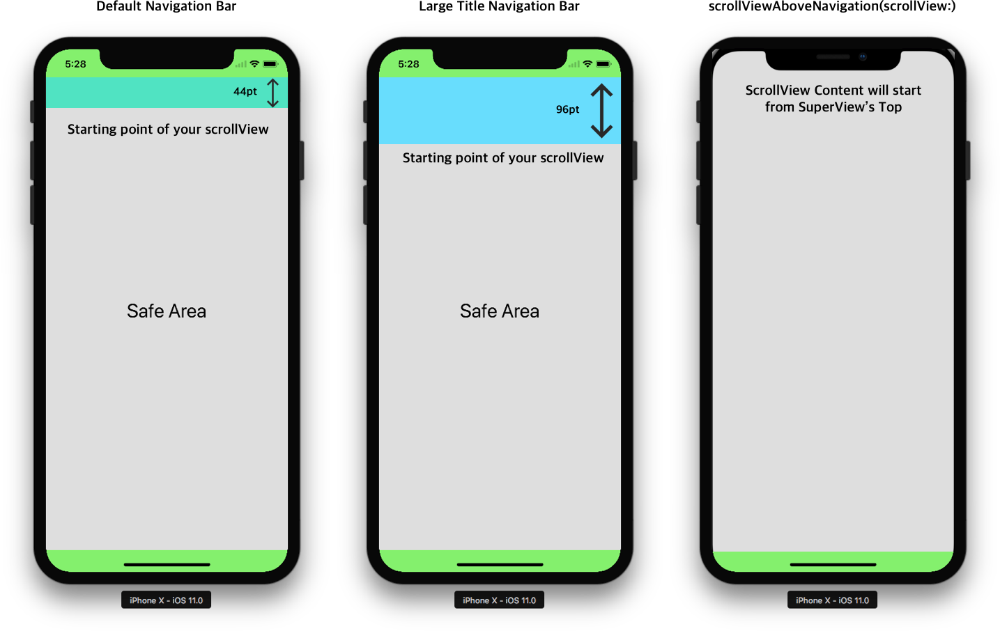

<p align="center">
  
</p>

#  Glass Navigation Bar

[](https://travis-ci.com/hcn1519/GlassNavigationBar)
[](https://developer.apple.com/swift/)


## Feature

*  Adjust your NavigationBar's Transparency, while scrolling 

## Demo

<table class="tg">
  <tr>
    <th>Demo1</th>
    <th>Demo2</th>
  </tr>
  <tr>
    <td></td>
    <td></td>
  </tr>
</table>

## Installation

### CocoaPods

You can install the latest release version of CocoaPods with the following command

```bash
$ gem install cocoapods
```

Simply add the following line to your Podfile:

```ruby
pod "GlassNavigationBar"
```

Then, run the following command:

```bash
$ pod install
```

## Requirements

`GlassNavigationBar` is written in Swift 4.1, and compatible with iOS 9.0+.

## How To Use

### Quick Start

1. Make your `navigationController` use `GlassNavigationController` instead of `UINavigationController`.

* If you use `storyboard`, Set the class of `navigationController` as `GlassNavigationController`.
* If you create your navigationController programatically, use `GlassNavigationController` instance instad of `UINavigationController` instance.

2. You need to pin `ScrollView` Top Constraint to it's `Superview`(make sure it is not `safeArea`)

3. Use `setNavbarTheme(isTransparent: scrollView:)` for your navigationBar basic theme.

```swift
override func viewWillAppear(_ animated: Bool) {
    super.viewWillAppear(animated)
    if let navbarController = self.navigationController as? GlassNavigationController {
        navbarController.setNavbarTheme(isTransparent: true, scrollView: scrollView, color: .green,
                                        tintColor: .yellow, hideBottomHairline: true, contentHeight: 600)
    }
}
```

4. Make your scrollview to put on your navigationBar.

```swift

override func viewDidLoad() {
    super.viewDidLoad()

    scrollView.delegate = self
    if let navbarController = self.navigationController as? GlassNavigationController {
        navbarController.extendedLayoutIncludesOpaqueBars(self)
        navbarController.scrollViewAboveNavigation(scrollView: scrollView)
    }
}
```

5. Set `UIScrollViewDelegate` to change your navigationBar's background color based on scroll.

```swift
extension ScrollViewController: UIScrollViewDelegate {
    func scrollViewDidScroll(_ scrollView: UIScrollView) {
        if let navbarController = self.navigationController as? GlassNavigationController {
            navbarController.scrollViewDidScroll(scrollView)
        }
    }
}
```

That's it. Build and run your app! 🎉🎉 If you don't know how to do this, open up our demo project and see it.

---

### Set NavigationBar theme

You can set navigationBar's theme by using  `setNavbarTheme(isTransparent: scrollView:)`.

```swift
override func viewWillAppear(_ animated: Bool) {
    super.viewWillAppear(animated)

    if let navbarController = self.navigationController as? GlassNavigationController {
        navbarController.setNavbarTheme(isTransparent: true, scrollView: self.scrollView)
        
        // With some options.
        navbarController.setNavbarTheme(isTransparent: true, scrollView: self.scrollView, color: .white,
        tintColor: .black, hideBottomHairline: true, contentHeight: 600)
    }
}
```

`setNavbarTheme(isTransparent: scrollView:)` offer you to set some otehr options we have. See Information about these properties(https://github.com/hcn1519/GlassNavigationBar#property-of-glassNavigationController).

### Put your scrollView above navigationBar

Apple's screen guide has been revised since the iPhone X was released. Apple recommends us to use `safeArea` for background autolayout. However, we often have to put our scroll view on the status bar. To do this, you first need to pin your `scrollView` top constraint to `superview` top constarint.(not `safeArea`). Then just use `adjustNavigationAlpha(scrollView:)`.

```swift
override func viewDidLoad() {
    super.viewDidLoad()
    if let navbarController = self.navigationController as? GlassNavigationController {
        navbarController.scrollViewAboveNavigation(scrollView: scrollView)
    }
}
```


Now Your content will start from top edge of iphone screen.


### Change Alpha of navigationBar's color based on ScrollView's content offset

`GlassNavigationController` use `UIScrollViewDelegate` to change your navigationBar's background color.

1. Set `UIScrollViewDelegate` for your ViewController

```swift
override func viewDidLoad() {
    super.viewDidLoad()
    scrollView.delegate = self
}
```
2. Allow your ViewController  `extendedLayoutIncludesOpaqueBars` to `true`

```swift
override func viewDidLoad() {
    super.viewDidLoad()
    if let navbarController = self.navigationController as? GlassNavigationController {
        navbarController.extendedLayoutIncludesOpaqueBars(self)
    }
}
```
If you don't do that, your scrollView works weird, when it's alpha becomes `1`.

3. Inside `scrollViewDidScroll` do like this.

```swift
extension ViewController: UIScrollViewDelegate {
    func scrollViewDidScroll(_ scrollView: UIScrollView) {
        if let navbarController = self.navigationController as? GlassNavigationController {
            navbarController.scrollViewDidScroll(scrollView)
        }
    }
}
```

⚠️ We highly recommend you to use this feature with `setNavbarTheme()` function, or set navigationBar's theme on `viewWillAppear`. If you do not, we can not guarantee that the theme of the navigation bar will remain the same when you return to the other screen and come back.

### Property Of GlassNavigationController

So far `GlassNavigationController` has 4 properties for you to use.

```swift
open var contentHeight: CGFloat?
```
`contentHeight` is the maximum height for navigation bar's alpha value. For example, if you set your `contentHeight` to 600, your navigationBar's alpha will be `1`, when your `scrollView.contentOffset.y` is 600.

If you don't set `contentHeight`, the default value will be `scrollView.contentSize.height`.

```swift
open var color: UIColor
```

`color` is for your navigationBar's background color.

```swift
open var isTransparent: Bool
```

`isTransparent` let you handle your navigationBar's transparency. If you set `isTransparent` to `true`, your navigationBar become transparent.

```swift
open var hideNavigationBottomLine: Bool
```

`UINavigationBar` has default bottomline. If you want to hide it, `hideNavigationBottomLine` to `true`.

---


## License

`GlassNavigationBar` is released under the MIT license. [See LICENSE](https://github.com/hcn1519/GlassNavigationBar/blob/master/LICENSE) for details.
